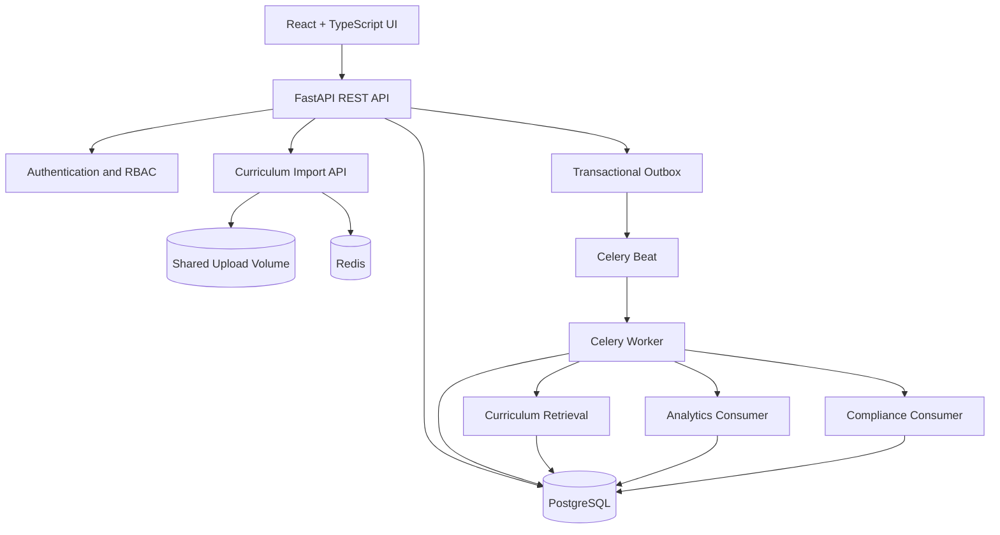
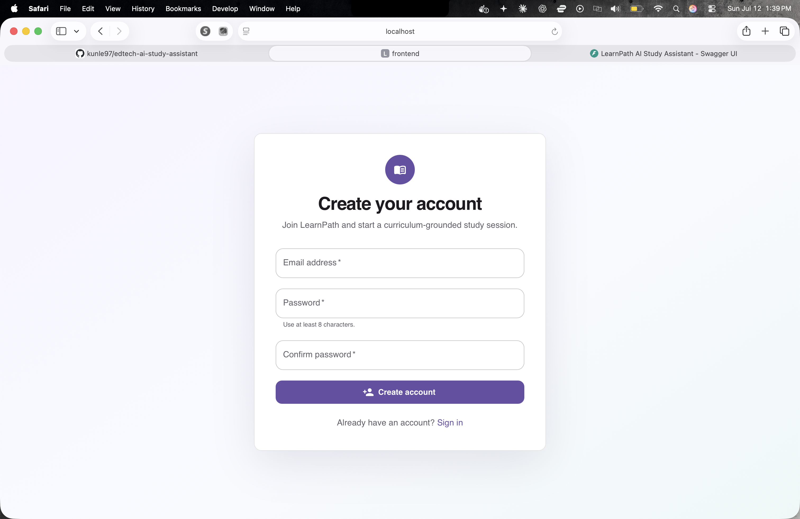
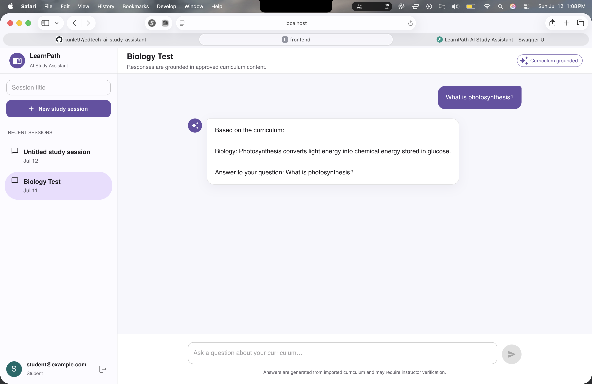
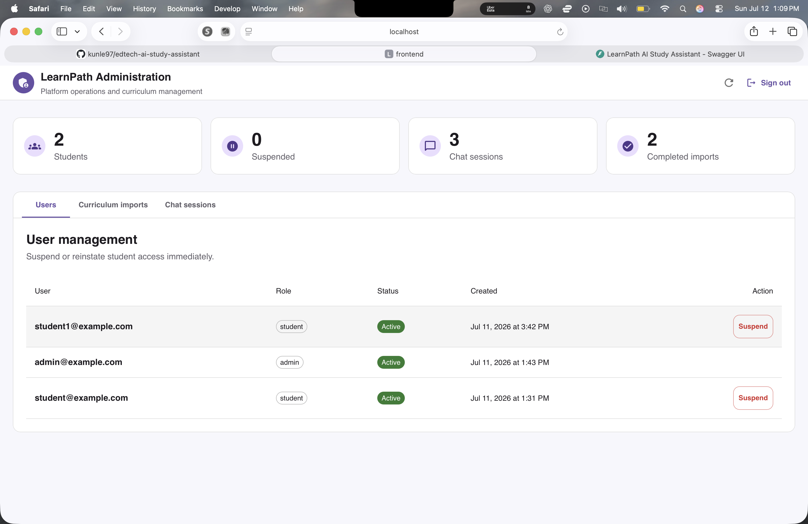
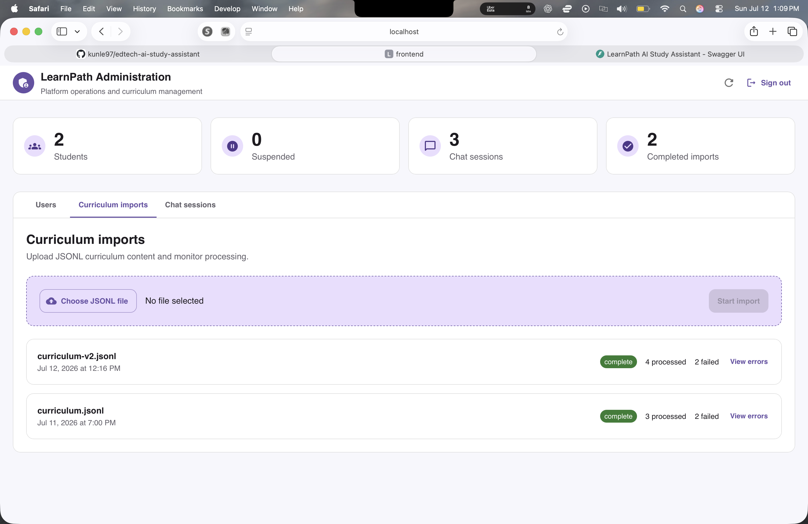
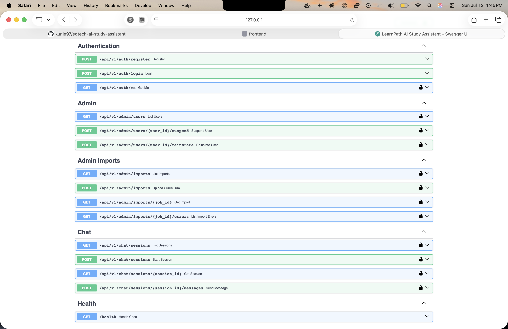

# LearnPath AI Study Assistant

An AI-powered study assistant that enables students to ask curriculum-grounded questions while providing administrators with tools to manage users, curriculum imports, and system activity.

---

## Overview

LearnPath was built to demonstrate production-oriented AI system design rather than simply exposing an LLM through an API.

The project combines Retrieval-Augmented Generation (RAG), asynchronous background processing, event-driven architecture, and the Transactional Outbox Pattern to provide reliable, curriculum-grounded responses while remaining scalable and fault tolerant.

The AI provider is intentionally abstracted behind an interface. The included implementation is deterministic so the application can run without external API keys, while making it straightforward to integrate providers such as OpenAI, Anthropic, Azure OpenAI, or Gemini.

# Features

## Student

- Secure JWT authentication
- Create multiple chat sessions
- Curriculum-grounded AI responses
- Persistent conversation history
- Asynchronous AI processing
- Automatic retry for transient AI failures

## Administrator

- Manage users
- Suspend/unsuspend accounts
- Upload curriculum
- Background curriculum processing
- Duplicate upload detection
- Import history
- Audit logging

## Platform

- Event-driven architecture
- Transactional Outbox Pattern
- Celery background workers
- Independent Analytics and Compliance consumers
- Redis-backed task queue
- PostgreSQL persistence
- Dockerized development environment

---

# Technology Stack

| Layer | Technology |
|---------|------------|
| Frontend | React, TypeScript, Material UI, Vite |
| Backend | FastAPI, Python |
| Database | PostgreSQL (pgvector-enabled image) |
| Queue | Redis |
| Background Jobs | Celery |
| ORM | SQLAlchemy |
| Migrations | Alembic |
| Authentication | JWT |
| Testing | Pytest |
| Containerization | Docker Compose |

---

<!-- # Architecture

```
                        React + TypeScript
                               |
                               |
                         FastAPI REST API
                               |
      ------------------------------------------------
      |                     |                        |
 Authentication        Curriculum Import         Chat API
      |                     |                        |
      |                     |                        |
 PostgreSQL <--------- Import Jobs ---------- Chat Sessions
      |
      |
 Transactional Outbox
      |
      |
 Celery Beat
      |
      |
 Publish Pending Events
      |
      |
 Celery Worker
      |
      |-------------------------------|
      |                               |
Chat Processing                  Import Processing
      |
      |
Chat Completed Event
      |
      |
-------------------------------
|                             |
Analytics Consumer      Compliance Consumer
``` --->
## Architecture


---

## High-Level Request Flow

1. An administrator uploads a curriculum JSONL file.
2. The API stores the upload and creates an import job.
3. Celery processes the curriculum asynchronously and stores valid records.
4. A student submits a question through the Chat API.
5. The message is persisted together with an Outbox event.
6. Celery retrieves relevant curriculum using PostgreSQL Full-Text Search.
7. The AI provider generates a curriculum-grounded response.
8. A completed interaction event is published.
9. Analytics and Compliance independently consume the event.

---

# Repository Structure

```
backend/
    app/
    alembic/
    tests/

frontend/
    src/

docs/
    adr/

sample-data/
```

---

# Prerequisites

- Python 3.11+
- Node.js 22+
- Docker Desktop

---

# Running the Project

Clone the repository.

Copy the environment variables.

```bash
cp .env.example .env
```

Start infrastructure.

```bash
docker compose up -d
```

---

## Backend

```bash
cd backend

python3 -m venv .venv

source .venv/bin/activate

pip install -r requirements.txt

uvicorn app.main:app --reload
```

Swagger

```
http://localhost:8000/docs
```

---

## Frontend

```bash
cd frontend

npm install

npm run dev
```

Application

```
http://localhost:5173
```

---

# Docker Services

The application consists of five containers.

| Service | Purpose |
|----------|----------|
| postgres | PostgreSQL database |
| redis | Redis task broker |
| api | FastAPI application |
| worker | Celery worker |
| beat | Celery scheduler |

Start everything.

```bash
docker compose up --build -d
```

---

# Creating the Initial Administrator

Public registration always creates student accounts.

Create the first administrator using:

```bash
cd backend

source .venv/bin/activate

python -m app.scripts.create_admin --email admin@example.com
```

You'll be prompted to securely enter the password.

---

# Running Tests

Start PostgreSQL first if it is not already running.

```bash
docker compose up -d postgres
```

Run backend tests.

```bash
cd backend

source .venv/bin/activate

pytest -v
```

Build the frontend.

```bash
cd ../frontend

npm run build
```

Current automated coverage includes:

- Authentication
- Registration
- Login
- Chat service
- Retrieval pipeline
- Curriculum search

---

# Reviewer Walkthrough

## 1. Start the application

```bash
docker compose up --build -d
```

---

## 2. Create an administrator

```bash
python -m app.scripts.create_admin --email admin@example.com
```

---

## 3. Login as Administrator

Open Swagger.

```
http://localhost:8000/docs
```

Authenticate.

---

## 4. Upload Sample Curriculum

The sample file intentionally contains both valid and invalid records so reviewers can verify successful processing as well as quarantined-record handling.

Use:

```
sample-data/curriculum.jsonl
```

Wait a few seconds for the background import to complete.

---

## 5. Register a Student

Use the Register endpoint or the frontend.

---

## 6. Login as Student

Create a chat session.

---

## 7. Ask Questions

The uploaded curriculum contains answers for questions such as:

```
What is photosynthesis?

Explain Newton's first law.

Summarize the French Revolution.

What is the quadratic formula?

Explain the water cycle.
```

Responses should be grounded in the uploaded curriculum.

---

## 8. Verify Event Processing (Optional)

Each completed chat interaction produces an Outbox event.

That event is independently consumed by:

- Analytics Consumer
- Compliance Consumer

Verify using:

```bash
docker exec learnpath-postgres \
psql -U learnpath -d learnpath \
-c "SELECT interaction_id, created_at FROM analytics_events ORDER BY created_at DESC LIMIT 5;"
```

```bash
docker exec learnpath-postgres \
psql -U learnpath -d learnpath \
-c "SELECT interaction_id, created_at FROM compliance_events ORDER BY created_at DESC LIMIT 5;"
```

```bash
docker exec learnpath-postgres \
psql -U learnpath -d learnpath \
-c "SELECT event_type, published_at, publish_attempts, last_error FROM outbox_events ORDER BY created_at DESC LIMIT 10;"
```

---

# Key Design Decisions

## Asynchronous Chat Processing

Student messages are queued using Celery to prevent long-running AI requests from blocking HTTP requests.


## Transactional Outbox Pattern

Chat completion events are first written to an Outbox table within the same database transaction.

A background publisher reliably delivers these events to downstream consumers.

This prevents lost events if the application crashes between committing the database transaction and publishing the event.


## Event-Driven Consumers

Analytics and Compliance are implemented as completely independent consumers.

Each maintains its own persistence model and processes events idempotently.


## Curriculum Retrieval

Responses are grounded exclusively in uploaded curriculum.

The retrieval pipeline:

- Normalizes the student's question
- Removes instructional stop words
- Uses PostgreSQL Full-Text Search
- Ranks matching curriculum
- Supplies retrieved context to the AI provider

PostgreSQL Full-Text Search was chosen because it is deterministic, lightweight, and requires no external embedding service.

The application already uses a pgvector-enabled PostgreSQL image, making semantic embeddings a natural future enhancement without changing the persistence layer.

---
## AI Provider Abstraction

The chat pipeline depends on an AI provider interface rather than a vendor-specific SDK.

The included deterministic provider keeps the project fully self-contained while demonstrating how hosted LLMs could be integrated without modifying the chat workflow.

---

## Suggested Reviewer Questions

After importing `sample-data/curriculum.jsonl`, try:

- What is photosynthesis?
- Explain Newton's first law.
- What is the Pythagorean theorem?

Questions outside the imported curriculum intentionally return a fallback response.

---

# Future Improvements

Given additional time, I would implement:

- Semantic vector search with pgvector embeddings
- Streaming AI responses
- WebSocket chat updates
- OpenTelemetry tracing
- Prometheus metrics
- CI/CD pipeline
- Kubernetes deployment
- Integration tests
- Rate limiting
- Distributed tracing

---

## Screenshots

### Login


### Student Registration



### Curriculum-Grounded Chat



### Administration



### Curriculum Import



### Swagger API



---

# Notes

This project was built as a Senior Software Engineer take-home assignment with an emphasis on engineering judgment, production-oriented architecture, maintainability, and reviewer usability rather than maximizing feature count.

# Author

Adekunle Ademefun